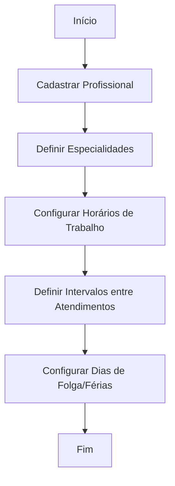
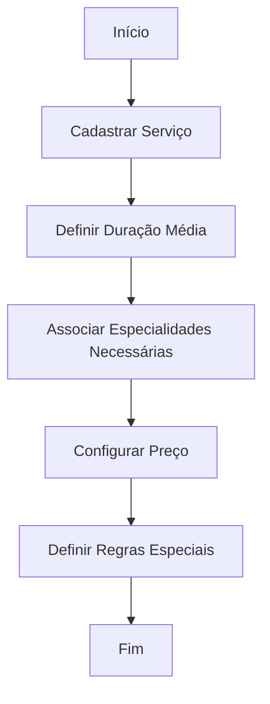
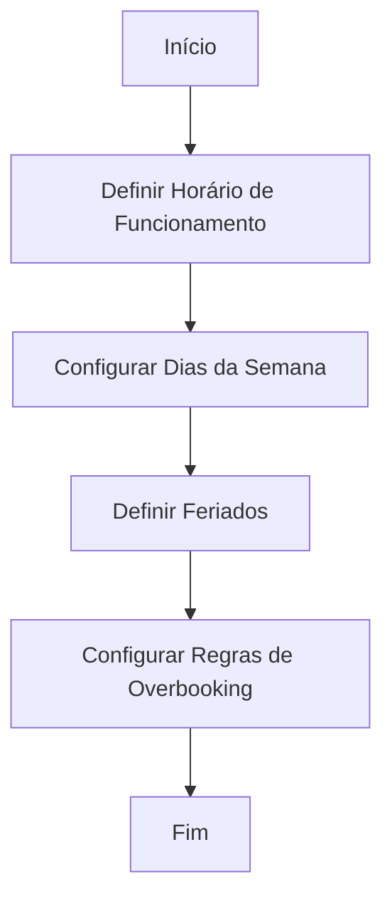
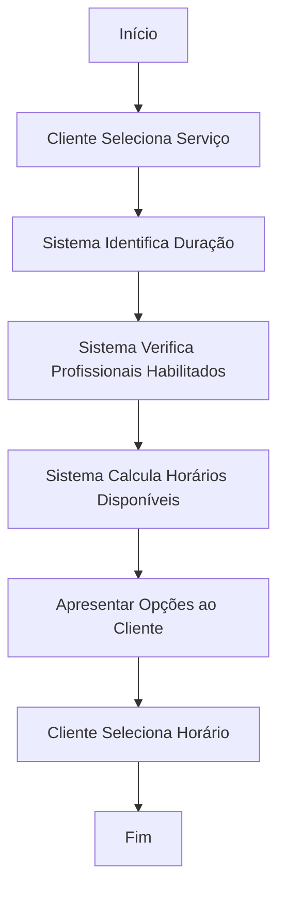
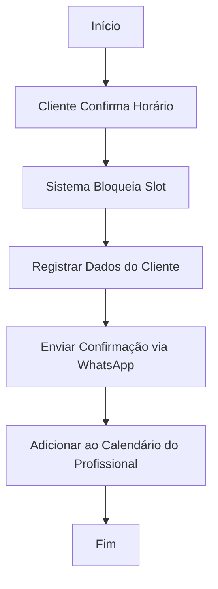
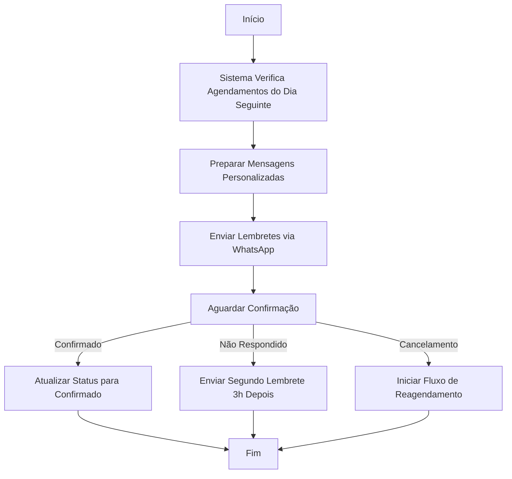
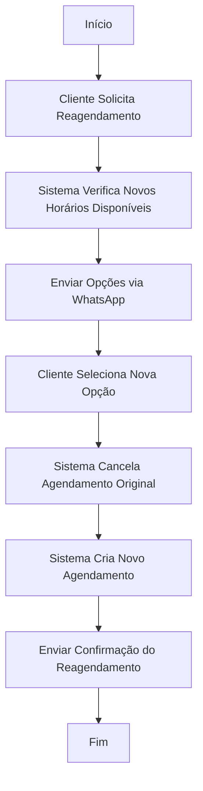
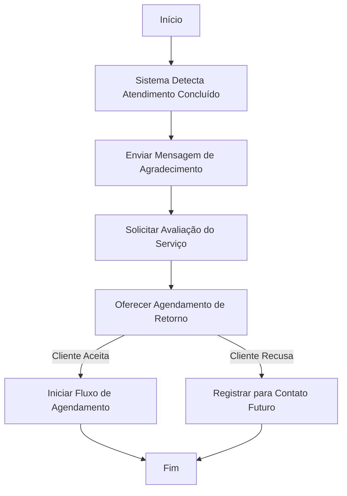
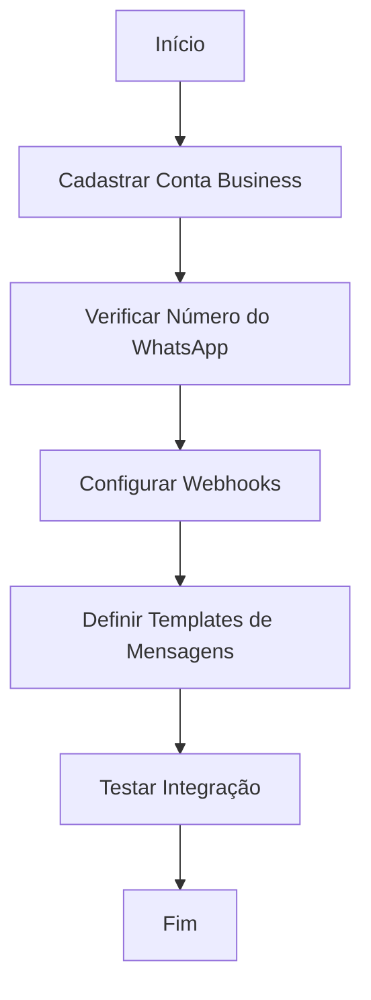

# Fluxos Automatizados para Salão de Beleza - TechCare Connect Automator

## Visão Geral

Este documento detalha os fluxos automatizados necessários para implementar um sistema completo de agendamento inteligente e comunicação automatizada para salões de beleza no TechCare Connect Automator.

## 1. Fluxo de Cadastro e Configuração

### 1.1 Cadastro de Profissionais


**Dados necessários:**
- Nome do profissional
- Especialidades (cabeleireiro, manicure, esteticista, etc.)
- Horários de trabalho (início/fim por dia da semana)
- Tempo de intervalo entre atendimentos
- Dias de folga e férias programadas

### 1.2 Cadastro de Serviços


**Dados necessários:**
- Nome do serviço
- Duração média (em minutos)
- Especialidades requeridas
- Preço base
- Regras especiais (ex: necessidade de intervalo após o serviço)

### 1.3 Configuração de Horários do Salão


**Dados necessários:**
- Horários de funcionamento por dia da semana
- Dias fechados (feriados, folgas coletivas)
- Capacidade máxima de atendimentos simultâneos
- Regras de overbooking (se aplicável)

## 2. Fluxo de Agendamento Inteligente

### 2.1 Identificação de Horários Disponíveis


**Lógica de processamento:**
1. Verificar quais profissionais podem realizar o serviço
2. Para cada profissional, verificar horários de trabalho
3. Excluir horários já agendados + duração do serviço
4. Excluir horários de intervalo entre atendimentos
5. Gerar lista de slots disponíveis
6. Ordenar por proximidade da data/hora desejada

### 2.2 Confirmação de Agendamento


**Dados necessários:**
- Dados do cliente (nome, telefone, preferências)
- Histórico de atendimentos anteriores
- Template de mensagem de confirmação

## 3. Fluxo de Comunicação Automatizada

### 3.1 Lembretes de Agendamento


**Regras de automação:**
- Enviar primeiro lembrete 24h antes do agendamento
- Se não houver resposta, enviar segundo lembrete 3h depois
- Permitir confirmação por resposta simples ("sim", "confirmo")
- Oferecer opção de cancelamento ou reagendamento

### 3.2 Fluxo de Reagendamento


**Regras de automação:**
- Oferecer até 3 opções de horários alternativos
- Priorizar mesmo profissional e data próxima
- Permitir seleção por resposta numérica simples
- Confirmar novo agendamento com todos os detalhes

### 3.3 Pós-Atendimento e Fidelização


**Regras de automação:**
- Enviar mensagem 1h após horário previsto de conclusão
- Incluir link para avaliação rápida (1-5 estrelas)
- Sugerir próximo agendamento baseado no tipo de serviço
- Para cortes de cabelo: sugerir retorno em 30 dias
- Para coloração: sugerir retorno em 45 dias
- Para tratamentos: seguir recomendação específica

## 4. Integração com WhatsApp Business API

### 4.1 Configuração da Integração


**Requisitos técnicos:**
- Conta WhatsApp Business API verificada
- Servidor para receber webhooks
- Templates de mensagem aprovados pelo WhatsApp
- Sistema de filas para mensagens

### 4.2 Templates de Mensagens

#### Template de Confirmação de Agendamento
```
Olá, {{1}}! Seu agendamento foi confirmado:

📅 Data: {{2}}
⏰ Horário: {{3}}
💇 Serviço: {{4}}
👩‍💼 Profissional: {{5}}

Para confirmar, responda SIM.
Para reagendar, responda REAGENDAR.
Para cancelar, responda CANCELAR.

Agradecemos a preferência!
```

#### Template de Lembrete
```
Olá, {{1}}! Lembrete do seu agendamento amanhã:

📅 Data: {{2}}
⏰ Horário: {{3}}
💇 Serviço: {{4}}
👩‍💼 Profissional: {{5}}

Para confirmar, responda SIM.
Para reagendar, responda REAGENDAR.
Para cancelar, responda CANCELAR.

Estamos ansiosos para recebê-lo(a)!
```

#### Template de Pós-Atendimento
```
Olá, {{1}}! Esperamos que tenha gostado do atendimento hoje.

Como foi sua experiência? Avalie de 1 a 5 estrelas.

Deseja agendar seu próximo {{2}} para {{3}}?
Responda SIM para agendarmos ou SUGERIR para outras datas.

Obrigado pela preferência!
```

## 5. Implementação Técnica

### 5.1 Banco de Dados

**Novas tabelas necessárias:**
- `salon_professionals` - Cadastro de profissionais
- `salon_services` - Serviços oferecidos
- `salon_working_hours` - Horários de trabalho
- `salon_service_professionals` - Relação serviço-profissional
- `salon_appointments` - Agendamentos
- `salon_appointment_history` - Histórico de alterações
- `salon_message_templates` - Templates de mensagens
- `salon_message_logs` - Registro de mensagens enviadas

### 5.2 APIs e Integrações

**APIs necessárias:**
1. **WhatsApp Business API**
   - Envio de mensagens
   - Recebimento de respostas
   - Gestão de templates

2. **Calendário**
   - Sincronização com Google Calendar
   - Exportação para iCalendar
   - Notificações de eventos

3. **Pagamentos** (opcional)
   - Pré-pagamento de reserva
   - Confirmação de pagamento
   - Reembolso em caso de cancelamento

### 5.3 Componentes de Frontend

**Novos componentes necessários:**
1. **Cadastro de Profissionais**
   - Formulário de cadastro
   - Gestão de horários
   - Associação com serviços

2. **Cadastro de Serviços**
   - Formulário de cadastro
   - Definição de duração e preço
   - Associação com profissionais

3. **Agendamento Inteligente**
   - Seleção de serviço
   - Visualização de horários disponíveis
   - Confirmação e pagamento

4. **Dashboard de Comunicação**
   - Visualização de mensagens enviadas
   - Status de confirmações
   - Gestão de templates

## 6. Considerações de Implementação

### 6.1 Prioridades de Desenvolvimento

1. **Fase 1: Estrutura Básica**
   - Implementação das tabelas de banco de dados
   - Cadastro de profissionais e serviços
   - Lógica de cálculo de disponibilidade

2. **Fase 2: Agendamento Inteligente**
   - Interface de seleção de horários
   - Algoritmo de sugestão inteligente
   - Confirmação de agendamentos

3. **Fase 3: Integração WhatsApp**
   - Configuração da API
   - Implementação de templates
   - Sistema de processamento de respostas

4. **Fase 4: Automação Completa**
   - Lembretes automáticos
   - Reagendamento inteligente
   - Fidelização pós-atendimento

### 6.2 Desafios Técnicos

1. **Cálculo de Disponibilidade**
   - Algoritmo complexo considerando múltiplas variáveis
   - Necessidade de alta performance para resposta em tempo real
   - Tratamento de conflitos e concorrência

2. **Integração WhatsApp**
   - Limitações da API do WhatsApp Business
   - Aprovação de templates de mensagem
   - Tratamento de respostas não estruturadas

3. **Experiência do Usuário**
   - Interface intuitiva para seleção de horários
   - Fluxo simplificado via WhatsApp
   - Gestão de expectativas em caso de indisponibilidade
