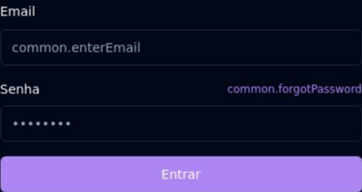
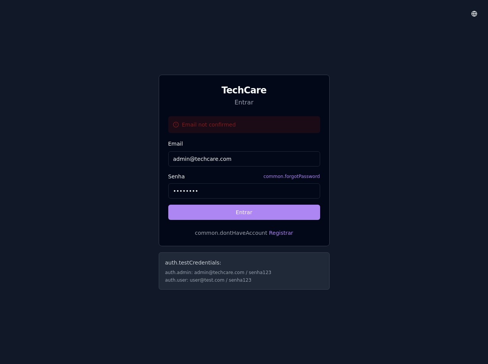

# Manual do Usuário - TechCare Connect Automator

## Sumário

1. [Introdução](#introdução)
2. [Requisitos do Sistema](#requisitos-do-sistema)
3. [Instalação](#instalação)
4. [Primeiros Passos](#primeiros-passos)
5. [Dashboard](#dashboard)
6. [Configuração de Automações](#configuração-de-automações)
7. [Monitoramento](#monitoramento)
8. [Relatórios](#relatórios)
9. [Solução de Problemas](#solução-de-problemas)
10. [Perguntas Frequentes](#perguntas-frequentes)

## Introdução

O TechCare Connect Automator é uma solução completa para automatizar interações com a plataforma TechCare, permitindo a extração de dados, geração de relatórios e execução de tarefas rotineiras sem intervenção manual.


### Principais Funcionalidades

- **Automação de Tarefas**: Configure tarefas para serem executadas automaticamente em horários específicos.
- **Extração de Dados**: Obtenha dados financeiros, relatórios de clientes e outras informações importantes.
- **Dashboard Intuitivo**: Visualize o status de todas as automações e resultados em um único lugar.
- **Monitoramento em Tempo Real**: Acompanhe o desempenho do sistema e receba alertas sobre problemas.
- **Escalabilidade**: Projetado para escalar de pequenas a grandes operações com milhares de usuários.

### Para Quem é Este Sistema

O TechCare Connect Automator é ideal para:

- Gestores que precisam de relatórios consolidados regularmente
- Equipes financeiras que necessitam de dados atualizados da plataforma TechCare
- Profissionais de marketing que desejam automatizar a coleta de métricas
- Administradores de sistema que buscam uma solução robusta e escalável

## Requisitos do Sistema

### Requisitos Mínimos

- Docker e Docker Compose
- 2GB de RAM
- 10GB de espaço em disco
- Conexão com a internet

### Requisitos Recomendados

- 4GB de RAM ou mais
- 20GB de espaço em disco
- Processador multi-core
- Conexão estável com a internet

## Instalação

A instalação do TechCare Connect Automator pode ser realizada de duas formas: usando Docker (recomendado) ou instalação manual.

### Instalação com Docker (Recomendada)

1. Clone o repositório:
   ```bash
   git clone https://github.com/Ze-Well-Souza/techcare-connect-automator.git
   cd techcare-connect-automator
   ```

2. Configure o arquivo de ambiente:
   ```bash
   cp .env.example .env
   # Edite o arquivo .env com suas credenciais e configurações
   ```

3. Inicie os serviços:
   ```bash
   docker-compose up -d
   ```

4. Verifique se os serviços estão em execução:
   ```bash
   docker-compose ps
   ```

### Instalação Manual

1. Clone o repositório:
   ```bash
   git clone https://github.com/Ze-Well-Souza/techcare-connect-automator.git
   cd techcare-connect-automator
   ```

2. Instale as dependências:
   ```bash
   npm install
   ```

3. Configure o arquivo de ambiente:
   ```bash
   cp .env.example .env
   # Edite o arquivo .env com suas credenciais e configurações
   ```

4. Inicie o Redis:
   ```bash
   # Instale o Redis de acordo com seu sistema operacional
   # Exemplo para Ubuntu:
   sudo apt update
   sudo apt install redis-server
   sudo systemctl start redis
   ```

5. Inicie os serviços:
   ```bash
   # Em terminais separados:
   npm run start:dashboard
   npm run start:automator
   npm run start:scheduler
   ```

## Primeiros Passos

Após a instalação, siga estes passos para começar a usar o TechCare Connect Automator:

1. Acesse o Dashboard em `http://localhost:3000` ou `http://localhost:8080` (dependendo da configuração)
2. Faça login com as credenciais configuradas no arquivo `.env`

   

3. Preencha seu email e senha

   

4. Clique em "Entrar" para acessar o sistema

   > **Nota**: Se você receber uma mensagem de erro "Email not confirmed", será necessário confirmar seu email antes de prosseguir. Verifique sua caixa de entrada ou entre em contato com o administrador do sistema.
   
   

5. Configure suas primeiras automações seguindo o assistente de configuração
6. Verifique o status das automações no painel principal

### Resolução de Problemas Comuns no Login

Se você encontrar problemas ao fazer login:

1. **Email não confirmado**: Verifique sua caixa de entrada para o email de confirmação
2. **Credenciais incorretas**: Verifique se as credenciais estão corretas e se correspondem às configuradas no arquivo `.env`
3. **Serviço indisponível**: Verifique se todos os serviços estão em execução usando `docker-compose ps`

Nas próximas seções, detalharemos cada funcionalidade do sistema.
